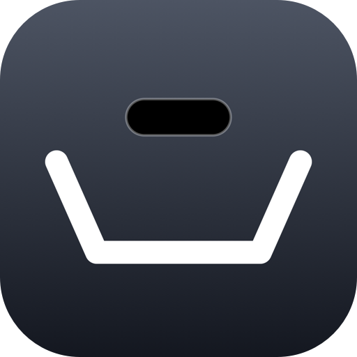

<p align="center">
  
</p>

<h1 align="center">IslandTray</h1>

**English** · [日本語](README.ja.md)

A shelf for files, photos and copied text on iPhone and iPad, with the Dynamic
Island as its handle. Drop things in while you work, see them in the island
from any app, and drag them out where they are needed.

## Features

- **Tray** — drag in files, photos, videos and text from any app. Items are
  copied into the app, so the tray keeps them even after the source moves on.
- **Dynamic Island / Live Activity** — the island shows how many items are
  waiting, with small thumbnails and filenames, and pages through them with
  buttons. Tapping it opens the tray.
- **Drag out** — drag a card into another app. Pick one up and tap others with
  a second finger to carry several at once, the way Photos and Files work.
- **Clipboard board** — keep what you copy instead of losing it to the next
  copy. Formatted text keeps its formatting for apps that support it and pastes
  as plain text everywhere else.
- **Share sheet** — send anything to the tray from another app's share sheet
  (a share extension on paid accounts, a ready-made shortcut on free ones).
- **Save to Files inbox** — anything saved to *On My iPhone → IslandTray* in
  Files is taken into the tray the next time the app opens.
- **Organise** — search across both boards, filter by kind, sort by name, date
  or size, group by kind, and switch between a grid and a list.
- **Remove** — swipe a row left to delete it (a full swipe deletes at once),
  select several to share or delete, or have items leave the tray once taken
  (cut instead of copy).
- **English and Japanese**, light/dark theme and a highlight colour of your own.

## Requirements

- iOS / iPadOS 17.0 or later
- To build: macOS with Xcode (Swift 6) and [XcodeGen](https://github.com/yonaskolb/XcodeGen)

## Getting started

```bash
brew install xcodegen
xcodegen generate
open IslandTray.xcodeproj
```

The Xcode project is generated from [`project.yml`](project.yml) and is not
checked in. Run the `IslandTray` scheme for a normal build, or
`IslandTray (Free)` to try the free-account setup (no App Group).

To build sideloadable `.ipa` files instead, see [docs/INSTALL.md](docs/INSTALL.md).

## Tests

```bash
xcodebuild test -project IslandTray.xcodeproj -scheme IslandTray \
  -destination 'platform=iOS Simulator,name=iPhone 17'
```

## Project layout

| Path | What it is |
|------|------------|
| `Sources/App` | The app: boards, drag in/out, App Intents for Shortcuts |
| `Sources/Widget` | The Live Activity shown in the Dynamic Island |
| `Sources/Share` | The share extension (needs an App Group) |
| `Sources/Shared` | Storage, ordering and filtering shared by all targets |
| `Resources/Shortcuts` | The signed shortcuts the app offers to install |
| `scripts/` | `make-ipa.sh`, `make-shortcuts.py`, `make-icon.swift` |
| `Tests/` | Unit tests |
| `docs/superpowers/` | Design spec and implementation plans (Japanese, development records) |

## Documentation

- [Changelog](CHANGELOG.md)
- [Install page (download the latest .ipa on your iPhone)](https://pikare02.github.io/IslandTray/)
- [Installing and building the .ipa](docs/INSTALL.md)
- [Shortcuts: share sheet, clipboard and keeping the island up](docs/SHORTCUTS.md)
